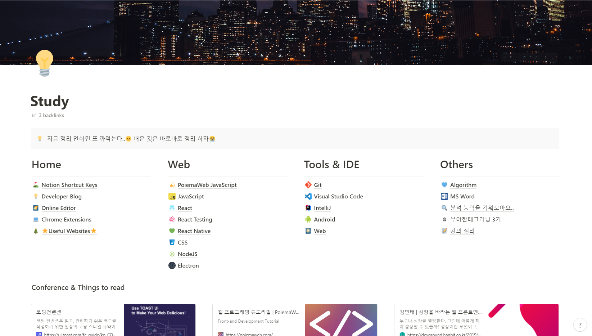

## 🌸 3월 목표 
블로그 첫 글이다! 두근두근 
이번달 부터 월간 목표를 세워서 계획 대로 살아보기로 결심했다..ㅎㅎ 

### 알고리즘 꾸준히 풀기
- 풀이한 알고리즘 문제 복습 
- 프로그래머스 Level2 10문제 풀기 

지금 주1회 릿코드 알고리즘 스터디를 하고있지만.. 나의 실력을 올리기엔 많이 부족하다고 느꼈다. 보통 처음 접한 유형의 알고리즘 문제는 최대한 고민 해보고 다른 블로그에 올라온 솔루션을 참고하면서 풀이를 하는데.. 이런 경우 다음에 비슷한 유형을 풀 때 또 까먹어서 시간을 소비하게 된다. 풀어본 문제는 일정한 주기를 두고 다시 복습하는 시간을 가져야 겠다. 그리고 프로그래머스 Level2 10문제 이상 푸는게 목표다. 맘같아선 20문제로 하고싶지만..ㅎㅎ 알고리즘 공부 외에도 할 것이 있기에 지킬 수 있는 만큼만 목표를 잡았다. 

### JS 공부 
- 스코프에 대해서 제대로 이해하기 
- JS 프로토타입 공부 
- 모던 자바스크립트 Deep Dive 19장 까지 읽어보기! 

작년 11월에 운좋게도 NHN FOWARD FE 상담소에 참가자로 선정되어 NHN 개발자분과 1대1로 상담하는 시간을 가질 수 있었다. 주니어 개발자로 일하면서 평소에 해결하지 못해 궁금한 점들을 정리해서 여쭤봤었는데 정말 상세하게 답변을 잘해주셔서 감사했고 너무 유익한 시간이였다.. 

그리고 지난 2년 동안 개발자로 살아온 시간에 대해서 반성하는 시간을 가질 수 있었다. JS로 처음 개발을 접했을 때 문법 정도만 익혀서 개발하고 모르는 것은 그때그때 검색하며 익히곤 했는데.. 정말 잘하는 개발자가 되려면 JS의 코어적인 부분을 알아야 겠다고 생각이 들었다. 

그래서 구입하게 된 책이 바로! 모던 자바스크립트 Deep Dive이다 😎. 한손으로 잘못들면 손목을 삐끗할 정도로 책이 정말 두껍다 ㅎㅎㅎ 작년 12월 말에 책을 구입했는데 아직 10장까지 밖에 읽지 못했다. 이번 달은 스코프에 대해서 이해하는게 목표이다. 매일 조금씩 읽어야겠다. 

### 사이드 프로젝트 
- 다이어리 앱 다시 진행하기 
- 글에 이미지 첨부해서 저장하는 기능 
- 캘린더에 글 데이터 연동 

가끔 요리해먹는걸 좋아하는데 레시피  기록할만한 깔끔한 앱을 찾던 도중 그나마 나아 보이는 앱을 선택해서 사용중이다. 근데 기록한 글 찾는게 불편해서 그냥 직접 만들어서 쓰기로 결심하고 그렇게 또 새로운 사이드 프로젝트를 열었다..ㅎ 

디자인도 최대한 깔끔하게 내 입맛대로 맞추고 무엇보다 사용하기 편리해야 한다! 1월엔 퇴근하고 매일 개발 했었는데 2월에는 시간과 체력이 부족해서 제대로 진행하지 못했다ㅠㅠ 이번달엔 글에 이미지 첨부해서 저장하는 기능이랑 캘린더에 데이터 연동하는 기능 개발하는게 목표이다. 얼른 개발 마쳐서 사용하고싶다 😭

### 노션 글 블로그로 이전 
2년전 신입 프론트엔드 개발자로 취업했을 때 정말 모든게 낯설었다..ㅎㅎ 사실 JS도 많이 써보지 않았고 React도 아주 기본 중에 기본인 투두리스트만 만들어 본게 전부였다. 업무 진행 하면서 새로 배운게 된거나 삽질했을 때 해결 경험등을 기록해두면 나중에 주변 동료들이나 미래의 나에게(?) 도움이 될거같아서 노션에 정리를 시작했었다. 처음엔 카테고리가 3개밖에 없었는데 2년이 다되어가는 지금은 아주 많은 카테고리가 생겼다. 

매일 노션에만 정리를 하다가 블로그를 만들기로 결심 하게된 이유는 2가지다. 고등학교 때 글쓰기가 너무 싫어서 이과를 선택했었고, 컴공에 가면 코딩만하고 글 쓸일이 많이 없을 줄 알았지만 현실은 그게 아니였다ㅠ 
언제까지 계속 피해만 다닐 수 없어서 블로그를 열어서 기술 정리겸 글쓰는 연습을 해야겠다고 다짐했다. 
글을 쓰고있는 지금도 너무 낯설지만 언젠가 쓰다 보면 익숙해지는 날이 오기를 ㅎㅎㅎ 

두번째 이유는, 정리한 글을 더 많은 사람들과 공유하고 싶어서다. 가끔 일하면서 삽질하다보면 구글 선생님의 도움을 받아 나와 비슷한 문제를 겪는 사람은 없는지, 어떤 식으로 해결을 하였는지 찾아보곤 한다. 내가 삽질한 경험을 잘 정리해서 비슷한 문제로 머리를 싸매고 고민하는 사람들에게 도움이 되고 싶다. 이번 달 부터 시작해서 차근차근 글을 옮겨야 겠다. 