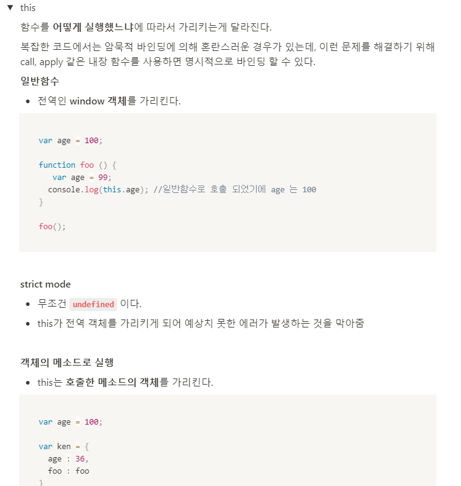

## 💬 3월 회고

3월은 정말 하루도 빠짐없이 바쁜 나날들의 연속이었다.. 매일 퇴근하고 지친 몸을 이끌고 공부하고 주말에도 쉬지 못하고 공부만 했다😂 예상치 못한 이벤트들로 인해 계획이 많이 틀어져서 지키지 못한 목표도 많지만, 나의 부족함과 평소에 그냥 스쳐 지나갔던 지식을 재정비할 수 있는 시간이었다.

## 🧮 알고리즘

이번 달은 코딜리티 문제 여러 개와 주 1회 진행하는 릿코드 스터디 위주로 진행했다. 시간적인 여유도 많이 없었고 목표로 잡은 프로그래머스 Level2 10문제 풀기는 달성하지 못했다😅 (반성 반성) 대신 이번 달엔 여태 공부해온 알고리즘을 테스트해볼 좋은 기회를 많이 경험했다. 확실히 공부를 전혀 하지 않았을 때 보다 문제를 많이 풀 수 있었고, 스터디할 때 풀어본 비슷한 문제들도 많이 나와서 공부한 보람이 있었다.👍

## 📚 JS 공부

3월의 80%는 JS 공부를 하며 보냈다. 목표로 잡은 모던 자바스크립트 19장까지 읽는 것은 지키지 못했고, 스코프랑 프로토타입 위주로 공부했다. ES6가 나오고 나서부터는 거의 class 키워드를 이용해서 객체를 생성했기 때문에 프로토타입에 대한 개념이 많이 없는 상태였는데 공부하면서 더 알게 됐다. 

이번 달에 제일 집중한 부분은 JS 기초 공부다. 사실 일하면서 스쳐 지나가면서 들었던 개념도 있었고 마음으로만 어떤 개념인지 이해하고 넘어간 것들도 있었다. 막상 누군가가 내게 특정 개념에 관해서 물었을 때 제대로 설명할 수 없었고 공부하면서 많이 반성했다.. 동료 개발자분께서 다른 사람에게 설명할 수 없으면 그 개념에 대해서 제대로 알고 있지 않은 것이라고 말씀해주신 게 크게 와닿았다. 하루에 2~3개씩 주제를 정해서 개념에 대해서 짧게 정리하는 시간을 가졌고 이 부분은 노션에 정리해두었다 ㅎㅎ 공부를 할 때 단순히 개념만 이해하는 게 아니라 이 기술을 어떤 이유에서 쓰는지, 왜 다른 기술에 비해 좋은지 이런 부분도 캐치하는 게 중요하다고 느꼈다.

## 💻 사이드 프로젝트

시간적인 여유가 전혀 나지 않아서 제대로 진행하지 못했습니다..반성합니다(?) 😭 

## 💬 3월을 돌아보며 
이제 바쁜 이벤트들도 다 끝났고, 다시 정비하는 시간을 가져야겠다. 이번 달은 운 좋게도 많은 경험을 해보고 스스로 부족한 부분에 대해서 반성하고 얻은 게 아주 많은 달이다. 아직 4월 계획을 세우진 않았지만 몇 가지 벌써 공부하고 싶어 지는 몇 가지 키워드가 떠오른다! CRA 없이 Webpack 으로 직접 환경 구성해서 프로젝트도 해보고 싶고 TypeScript도 해보고 싶다. 그리고 TDD도 도입해보고 싶다! 하고 싶은건 또 왜 이렇게 많은지 😂 